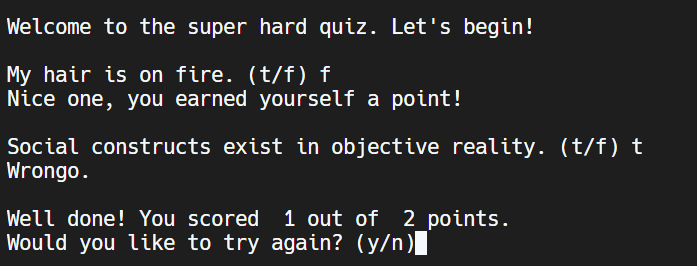

# Instructions  


Ok kiddos, time to face the music, put your coding skills to the test and make something original.
  1. You will be assigned a topic from the last unit.
  2. Create 5 questions for a quiz. True/false and multiple choice work best here. Short answer can work, but is more challenging.
  3. Use all the skills we have learned so far to build your quiz (code snippets below). These include:
   - assign values to variables
   - take input from the user
   - cast data (convert from string to integer)
   - use selection and conditionals
   - create functions, return values
   - And of course, plenty of printing
  5. I have outlined what your code should look like in comments in the main program file.

Your final project should look something like this, but with 5 or more questions, and, you know, not rediculous questions.




## Icelandic level "hot"
  1. 1-4 Question Functions
  2. Call the functions in the main program
     
## Moderate Spicy
  1. Five question functions that return points and print correct answer when wrong
  2. Call the function in the main program
  3. Share final score with user at the end of the quiz. "You received 12 out of a babillion points! Amazeballs."

## Proper Spicy
  1.  Once finished, ask user if they want to play again.
  2. Print Answer Key at the end
  3. Allow users a second chance when wrong


## Ghost Pepper Spicy
  1. Create a timer for each question and allow the user to decide how long the timer should be.
  2. Use tkinter to make a GUI (especially useful with flowchart symbols)


Code Snippets that use what we have learned so far.
```python
def whichCake(ingredient):
  if ingredient == "chocolate":
    print("Mmmm, chocolate cake, dabest")
  elif ingredient == "broccoli"
    print("Say hwaaaaa")
  else:
    print("Ok, if you go for that sort of thing")
    
```

```python
def areaOfTriangle(base, height):
  area = 0.5 * base * height
  return area

user_base = int(input("What is the base? "))
user_height = int(input("What is the height? "))

area = areaOfTriangle(user_base, user_height)
print("The area of your triangle is", area)

```
  